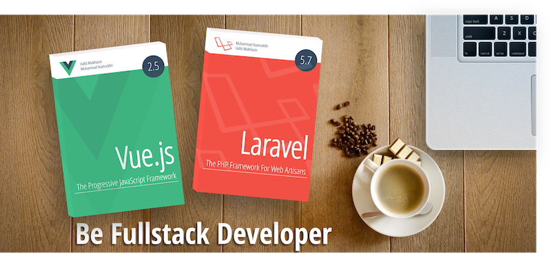

# Vueshop

Demo [https://vueshop.id](https://vueshop.id)

## Overview
Vueshop adalah aplikasi toko online berbasis mobile web yang dibangun dengan menggunakan framework Javascript [Vue](https://vuejs.org) dan framework user interface berbasis Vue yaitu [Vuetify](https://vuetifyjs.com).

Vueshop merupakan bagian dari projek studi kasus pada buku ["Be Fullstack Developer"](http://buku-laravel-vue.com)

[](http://buku-laravel-vue.com)

Link studi kasus lain pada buku ini:
- [Larashop](https://github.com/laravel-vue-book/larashop)
- [Larashop-api](https://github.com/laravel-vue-book/larashop-api)


## Getting Started

1. Clone repository ini, 
2. Buat file konfigurasi untuk environment lokal caranya  `cp .env.production .env.development.local` 
3. Update konfigurasi pada file `.env.development.local`
4. Kemudian via terminal, jalankan perintah `npm install` 

Selanjutnya..

### Compiles and hot-reloads for development
```
npm run serve
```

### Compiles and minifies for production
```
npm run build
```

### Lints and fixes files
```
npm run lint
```

### Run your unit tests
```
npm run test:unit
```

## Authors

Penulis buku ini adalah [Hafid Mukhlasin](http://hafidmukhlasin.com) dan [Muhammad Azamuddin](http://arrowfunxtion.com)